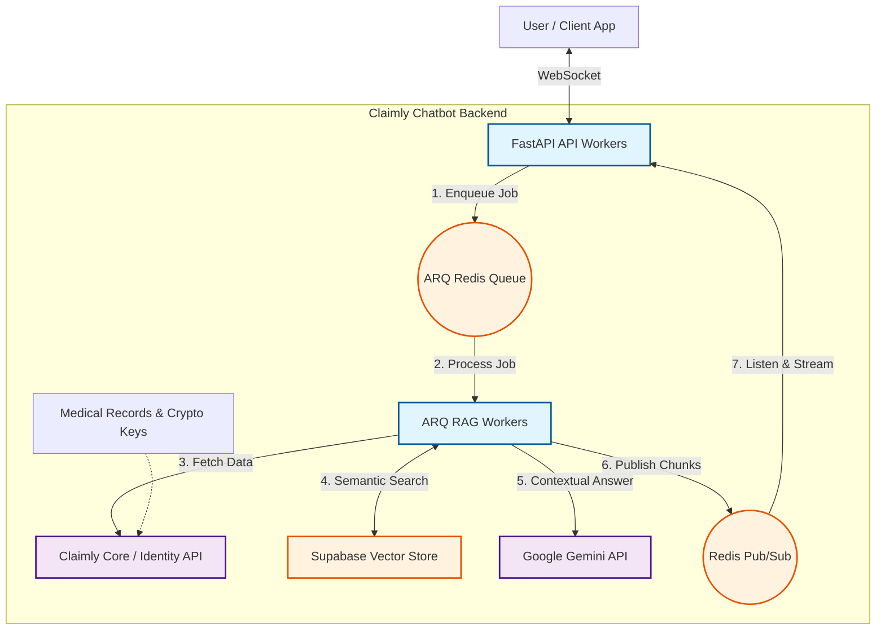

# Claimly RAG Chatbot: Secure On-Demand Medical Assistant

**Claimly RAG Chatbot** adalah backend service berbasis AI yang mengutamakan privasi (*privacy-first*) dan *zero-persistence* untuk menangani rekam medis sensitif. Menggunakan **FastAPI**, **Redis (RAM-only)**, dan **Google Gemini**, sistem ini memberikan wawasan medis secara real-time melalui WebSockets yang aman.

---

## ⚡ Arsitektur Performa Tinggi (Windows Optimized)

Sistem ini didesain khusus untuk menangani **100+ concurrent users** di lingkungan Windows dengan optimasi berikut:

- **Winloop (IOCP)**: Menggunakan event loop berbasis IOCP untuk I/O asinkron yang sangat cepat di Windows.
- **Shared PubSub Listener**: Menggunakan satu koneksi Redis Pub/Sub global per worker process. Pesan didistribusikan secara internal melalui `asyncio.Queue` (Fan-out pattern) untuk menghemat ribuan koneksi Redis.
- **Multi-Worker Scaling**: Berjalan dalam mode multi-process (4 API workers & 4 Worker instances) untuk memanfaatkan seluruh core CPU.



---

## 🛠️ Sistem Mock (Developer Mode)

Untuk pengujian tanpa memakan kuota API atau membutuhkan database asli, gunakan flag environment berikut:

- `MOCK_AI=true`: Mengganti pemanggilan Gemini dengan respon streaming simulasi.
- `MOCK_AUTH=true`: Melewati validasi token Supabase (user_id otomatis `mock_user_123`).
- `MOCK_IDENTITY=true`: Menggunakan kunci enkripsi statis tanpa perlu derivasi Argon2id yang berat di CPU.

---

## 🚀 Cara Menjalankan (Production/Scale Mode)

Gunakan skrip PowerShell yang disediakan untuk konsistensi environment:

1.  **Jalankan Workers**:
    ```powershell
    .\run_workers.ps1
    ```
    *(Membuka 4 jendela worker baru dengan `MOCK_AI=true`)*

2.  **Jalankan API**:
    ```powershell
    .\run_api.ps1
    ```
    *(Menjalankan FastAPI dengan 4 workers di port 8000)*

---

## 📊 Load Testing (k6)

Kami menggunakan [k6](https://k6.io/) untuk memvalidasi performa sistem.

**Kebutuhan**: Instal k6 di Windows (`winget install gnu.k6`).

**Eksekusi Test**:
```powershell
k6 run tests/load/chat_load_test.js
```

---

## 🧪 Unit Testing (Pytest)

Kami menggunakan **Pytest** untuk pengujian fungsional secara terisolasi (offline/mocked).

**Kebutuhan**: Instal dependensi testing (`pip install pytest pytest-asyncio pytest-mock pytest-cov`).

**Eksekusi Unit Test**:
```powershell
# Menjalankan seluruh unit test
.\venv\Scripts\python.exe -m pytest tests/unit/

# Menjalankan dengan laporan detail coverage
.\venv\Scripts\python.exe -m pytest --cov=app tests/unit/ --cov-report=term-missing
```

**Skenario yang Diuji**:
- **KMS Service**: Enkripsi/dekripsi AES-GCM dan derivasi kunci.
- **AI Service**: Intent detection dan streaming response (Mocked Gemini).
- **Socket Router**: Lifecycle koneksi, auth bypass, dan antrean pesan.
- **Redis Pool**: Singleton pattern dan penanganan kegagalan koneksi.

---

**Target Performa (SLA)**:
- **TTFC (Time to First Chunk)**: p95 < 2.0 detik.
- **Success Rate**: 100% (No disconnected/timeout).

---

## 🔐 Keamanan & Kriptografi (Privacy-First)

Sistem ini menggunakan standar enkripsi industri untuk memastikan rekam medis tetap rahasia.

### 1. Dekripsi Private Key (Password-Based)
*   **Algoritma**: PBKDF2-SHA256 & AES-256-GCM.
*   **Proses**: Password user digunakan untuk menurunkan *Key Encryption Key* (KEK) melalui **PBKDF2 (310.000 iterasi)**. KEK ini digunakan untuk mendekripsi kunci privat (*Private Key*) user yang diambil dari Identity API.

### 2. Dekripsi Rekam Medis (ECIES)
*   **Algoritma**: P-256 ECIES (ECDH + SHA256 KDF + AES-256-GCM).
*   **Proses**: Menggunakan mekanisme *Elliptic Curve Integrated Encryption Scheme*. Kunci privat user dipadukan dengan **Ephemeral Public Key (EPK)** yang ada di dalam payload rekam medis untuk menghasilkan kunci AES-256 secara *on-the-fly* guna mendekripsi isi catatan medis.

### 3. Enkripsi Payload Internal
*   **Algoritma**: AES-256-GCM dengan App Secret.
*   **Proses**: Data tugas yang dikirim ke background worker (via Redis) dienkripsi menggunakan internal secret aplikasi untuk mencegah kebocoran data di lapisan antrean (*message broker*).

---

## 📂 Struktur Proyek & File Penting

| File / Folder | Fungsi Utama |
| :--- | :--- |
| `app/main.py` | Entry point dengan integrasi `winloop` dan `Shared PubSub Listener`. |
| `app/routers/websocket.py` | Manajemen koneksi WebSocket dengan sistem antrean internal per-user. |
| `app/workers/rag_worker.py` | Backend worker (ARQ) yang memproses tugas RAG berat. |
| `run_api.ps1` / `run_workers.ps1` | Skrip otomasi deployment lokal dengan konfigurasi optimal. |

---

## 📡 Skema WebSocket
1.  **session_init**: Server mengirim UUID sesi segera setelah koneksi terbuka.
2.  **input**: Client mengirim `{ "prompt", "password", "accessToken" }`.
3.  **status**: Server memberi tahu status proses (misal: "Menghubungi AI...").
4.  **chunk**: Server mendorong potongan teks secara real-time.
5.  **final**: Pesan `is_final: true` menandakan akhir dari satu jawaban.
